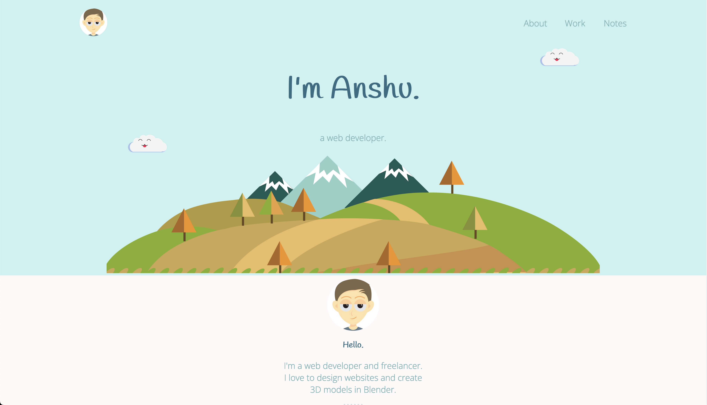

# 🌐 Personal Site

A visually appealing and responsive personal website built to showcase skills, projects, and professional information. Designed with clean and minimalistic aesthetics, the site features smooth navigation and creative design elements.

Link: [https://anshusinha26.github.io/Personal-Site](https://anshusinha26.github.io/Personal-Site)

---

## 📸 Screenshots

---

## ✨ Features

- Custom Design: Unique and personalized layout.
- Responsive Design: Optimized for various screen sizes and devices.
- Professional Branding: Showcases the user's work and personal details.
- Easy Navigation: Clear and accessible menu for seamless browsing.

---

## ⚙️ Tech Stack

- HTML: For structuring the content and layout.
- CSS: For styling and enhancing the visual appeal.
